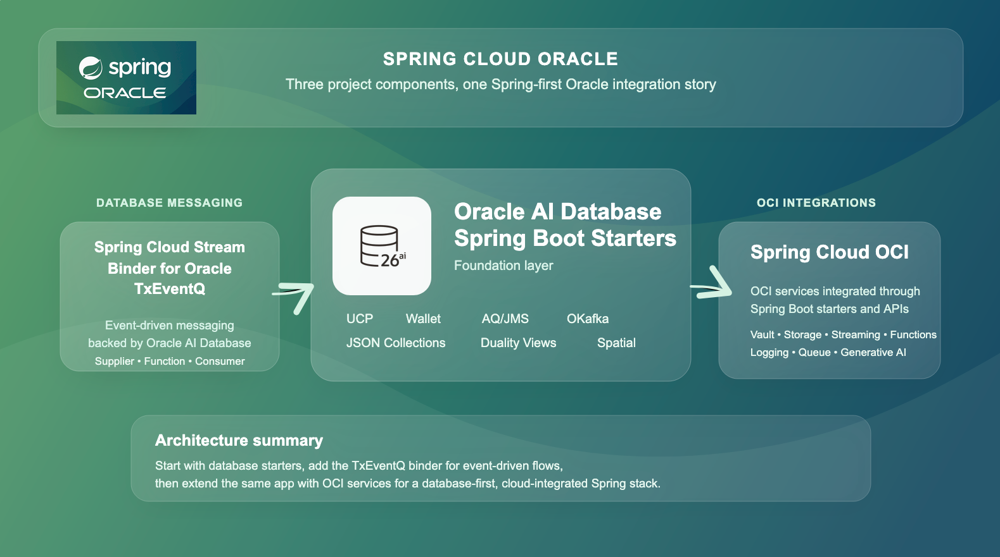

# Spring Cloud Oracle

Spring Cloud Oracle brings Oracle AI Database, Oracle AI Database-native messaging, and Oracle Cloud Infrastructure (OCI) into the Spring application model. It's a collection of Spring Boot starters, auto-configuration, templates, integrations, and samples for teams building data-intensive and cloud-connected services with Oracle technologies.

## Overview

Spring Cloud Oracle is organized as three complementary subprojects:

- Oracle AI Database Spring Boot Starters
- Spring Cloud Stream Binder for Oracle TxEventQ
- Spring Cloud OCI

Together, they provide a consistent way to build Spring applications that connect to Oracle AI Database with production-ready connection management, build event-driven services on top of Oracle AI Database Transactional Event Queues (TxEventQ), and extend those applications with managed OCI services such as Vault, Object Storage, Streaming, Functions, and Generative AI.

## Why Spring Cloud Oracle?

Spring teams using Oracle technologies often need more than raw client libraries. They need infrastructure that fits naturally into Spring Boot applications, works with existing configuration conventions, and supports both local development and production deployment.

Spring Cloud Oracle focuses on that integration layer:

- Database-first Spring Boot starters for connectivity, messaging, JSON data, and spatial workloads
- Event-driven architectures built on Oracle AI Database Transactional Event Queues through Spring Cloud Stream
- OCI integrations exposed through Spring Boot abstractions such as property sources, resources, templates, and auto-configured clients
- Sample applications that show the dependencies, configuration, and usage patterns in context

## Oracle AI Database Spring Boot Starters

The database starters are the foundation of the project. They make Oracle AI Database feel like a natural part of a Spring Boot application instead of a separate integration concern.

Key capabilities include:

- **Universal Connection Pool (UCP)** for Oracle-backed `DataSource` configuration and connection pooling
- **Wallet support** for secure database connectivity using Oracle Wallet
- **AQ/JMS support** for Oracle Advanced Queuing and Transactional Event Queues with Spring JMS-style applications
- **OKafka support** for applications that want to use Apache Kafka Java APIs backed by Oracle AI Database Transactional Event Queues
- **JSON Collections** support for document-style development on Oracle AI Database
- **JSON Relational Duality Views** tooling for modern JSON-relational application models
- **OpenTelemetry support** for instrumenting the OJDBC driver in Spring Boot applications

These starters are intended for teams building CRUD services, data APIs, event-driven services, and modern database applications on Oracle AI Database without giving up the conventions of Spring Boot.

## Spring Cloud Stream Binder for Oracle TxEventQ

The TxEventQ binder brings Oracle AI Database Transactional Event Queues into the Spring Cloud Stream programming model. Instead of treating the database and the messaging system as separate infrastructure layers, this binder lets Spring applications produce and consume messages against Oracle AI Database-backed queues using standard Spring Cloud Stream patterns.

That makes it a strong fit for applications that want:

- Spring Cloud Stream `Supplier`, `Function`, and `Consumer` bindings
- Oracle AI Database-backed transactional messaging
- A converged architecture where application data and message flows live in the same platform
- High-throughput event processing using Oracle AI Database TxEventQ

For teams on Oracle AI Database, the binder offers a direct path to event-driven microservices without introducing a separate broker to participate in the Spring Cloud Stream ecosystem.

## Spring Cloud OCI

Spring Cloud OCI extends the project beyond the database and into Oracle Cloud Infrastructure. It provides a core starter for OCI authentication and shared configuration, plus service-specific starters that expose OCI capabilities through Spring-friendly APIs and auto-configuration.

Supported integrations include:

- Object Storage
- Autonomous Database lifecycle operations
- Vault as an API client and Spring property source
- Streaming
- Queue
- Notifications
- Logging
- Email Delivery
- Functions
- Oracle NoSQL Database
- Generative AI

This lets Spring applications combine Oracle AI Database with surrounding managed services for configuration, messaging, storage, logging, AI features, and runtime integration on OCI.

## How the Pieces Fit Together

A typical adoption path starts with the database starters. Teams use UCP, Wallet support, JSON features, AQ/JMS, or OKafka to build Spring Boot services directly on Oracle AI Database. From there, they can add the TxEventQ binder for Spring Cloud Stream workloads and bring in Spring Cloud OCI starters when the application needs managed cloud services such as Vault, Object Storage, Functions, or Generative AI.

The result is a project that supports both database-centered application design and broader OCI-connected architectures, while keeping the programming model aligned with Spring Boot and Spring Cloud.

## Getting Started

Start with the repository and project overview:

- GitHub repository: [oracle/spring-cloud-oracle](https://github.com/oracle/spring-cloud-oracle)
- Project introduction: [Spring Cloud Oracle intro docs](https://oracle.github.io/spring-cloud-oracle/site/docs/intro)

Explore each subproject:

- [Database starters overview](https://github.com/oracle/spring-cloud-oracle/tree/main/database/starters)
- [TxEventQ binder overview](https://oracle.github.io/spring-cloud-oracle/site/docs/stream-binder/overview)
- [Spring Cloud OCI overview](https://oracle.github.io/spring-cloud-oracle/site/docs/oci/core)

## Samples and Resources

The repository includes sample applications that show how the project is intended to be used in real Spring applications:

- [OCI samples](https://github.com/oracle/spring-cloud-oracle/tree/main/spring-cloud-oci/spring-cloud-oci-samples)
- [Database starter samples](https://github.com/oracle/spring-cloud-oracle/tree/main/database/starters/oracle-spring-boot-starter-samples)
- [TxEventQ binder sample](https://github.com/oracle/spring-cloud-oracle/tree/main/database/spring-cloud-stream-binder-oracle-txeventq/spring-cloud-stream-binder-txeventq-sample)

## Contributing

Spring Cloud Oracle is an open project, and contributions are welcome. See the repository contribution guide for details:

- [CONTRIBUTING.md](https://github.com/oracle/spring-cloud-oracle/blob/main/CONTRIBUTING.md)
